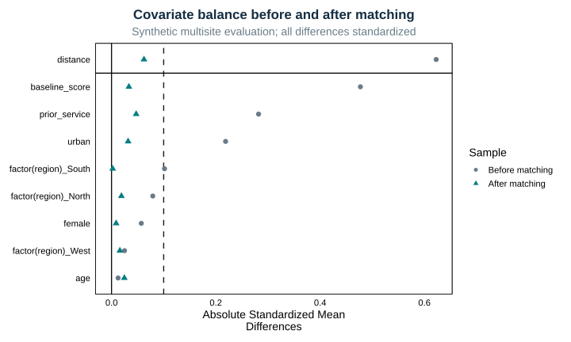
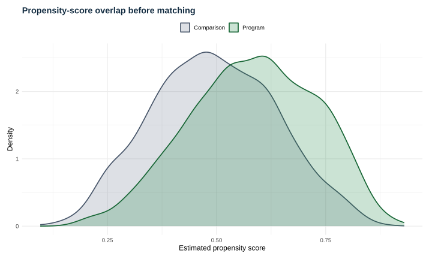
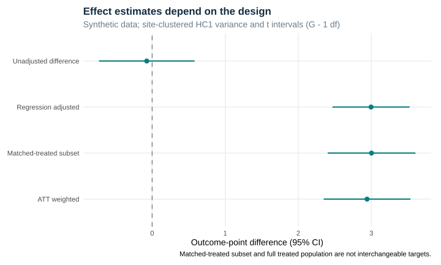

# Executed program-evaluation report

## Question and design

Can a prespecified matching/weighting workflow recover the constant 2.75-point effect in a synthetic multisite evaluation? Treatment depends on observed baseline factors. Real-world identification additionally requires no unmeasured confounding, positivity, and consistency.

## Who remains matched?

| group | before | matched | unmatched | retained_percent |
| --- | --- | --- | --- | --- |
| Comparison | 1099 | 918 | 181 | 83.530 |
| Program | 1301 | 918 | 383 | 70.561 |

The standardized propensity-score caliper is 0.10. It was tightened after an outcome-blind balance audit; see [design revision](../docs/design-revision.md). The original 0.20 rule failed the declared 0.10 balance threshold.

A caliper can exclude treated observations. The matched analysis targets the retained treated subset when this occurs; weighting targets the full treated population under its assumptions.

## Design diagnostics

[Weight diagnostics](weight_diagnostics.csv). Propensity scores are clipped to 0.01–0.99 before ATT weighting; this numerical rule is not a substitute for overlap assessment.

## Estimates

| estimator | estimate | std_error | conf_low | conf_high | n | clusters | degrees_freedom |
| --- | --- | --- | --- | --- | --- | --- | --- |
| Unadjusted difference | -0.074 | 0.327 | -0.728 | 0.581 | 2400 | 60 | 59 |
| Regression adjusted | 2.996 | 0.264 | 2.468 | 3.524 | 2400 | 60 | 59 |
| Matched-treated subset | 3.002 | 0.300 | 2.402 | 3.603 | 1836 | 60 | 59 |
| ATT weighted | 2.941 | 0.297 | 2.348 | 3.535 | 2400 | 60 | 59 |

## Limitations

These are synthetic recovery checks, not evidence of a real program effect. Site-clustered HC1 intervals do not capture every source of matching/propensity-estimation uncertainty. Caliper restrictions change the analyzed population. No unmeasured-confounding sensitivity model is claimed.

## Reproduction

This report and its figures are generated by the repository scripts from deterministic synthetic data.
See the repository README for commands and the versioned environment.

[Runtime session and package versions](session-info.txt)
